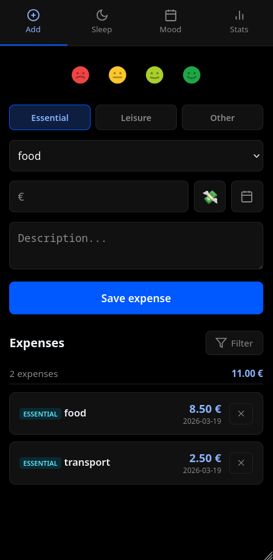
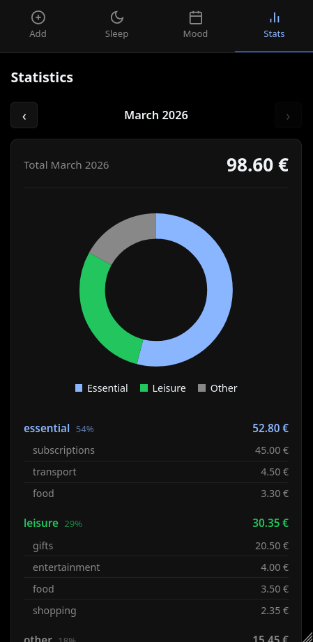

# Life Tracker

A minimalist personal PWA for tracking daily **expenses**, **sleep**, and **mood** — with long-term correlation stats.

Built for daily use on an AMOLED phone screen. Zero external dependencies beyond Chart.js. No backend framework. No database ORM. Just Cloudflare Workers + D1 (SQLite) + vanilla JS/HTML/CSS.

> **Personal use disclaimer:** This is a personal project with no authentication layer. If you deploy it publicly, anyone who knows your Worker URL can read and write your data. See the [Security](#security) section below.

---

## Features

- **Expenses** — log amount, category, and macro type (essential / leisure / other). Filter by period and macro.
- **Sleep** — tap to record bedtime and wake-up time. Hours rounded to the nearest half-hour. 7-day chart with mood overlay.
- **Mood** — 4-level scale (Bad / Low / Good / Great). Monthly and yearly calendar views.
- **Stats** — monthly breakdown by macro and category, correlation medians (mood × sleep, mood × expense, sleep × expense), weekly trend bar chart.
- **PWA** — installable, works offline via service worker, AMOLED-optimised dark theme.
- **Preset expenses** — configurable quick-fill popup for recurring costs (subscriptions, passes, etc.).

---
## Screenshots
 

## Tech Stack

| Layer    | Technology                        |
|----------|-----------------------------------|
| API      | Cloudflare Workers (JS)           |
| Database | Cloudflare D1 (SQLite)            |
| Frontend | Vanilla JS / HTML / CSS (PWA)     |
| Charts   | Chart.js 4 (CDN)                  |
| Hosting  | Cloudflare Pages                  |

---

## Project Structure

```
tracker/
├── schema.sql              # D1 database schema
├── worker/
│   ├── src/
│   │   └── index.js        # Cloudflare Worker (REST API)
│   ├── wrangler.toml       # Worker config — fill in your database_id
│   └── package.json
└── frontend/
    ├── index.html
    ├── app.js              # All frontend logic — set API constant at top
    ├── style.css
    ├── manifest.json
    ├── sw.js               # Service worker
    ├── icon-192.png
    └── icon-512.png
```

---

## Setup

### Prerequisites

- [Node.js](https://nodejs.org/) (for Wrangler CLI)
- A [Cloudflare account](https://dash.cloudflare.com/) (free tier is sufficient)

### 1 — Create the D1 database

```bash
npx wrangler d1 create your-tracker-db
```

Copy the `database_id` from the output.

### 2 — Apply the schema

```bash
npx wrangler d1 execute your-tracker-db --file=schema.sql
```

### 3 — Configure the Worker

Edit `worker/wrangler.toml` and replace the placeholder values:

```toml
name = "life-tracker-worker"
main = "src/index.js"
compatibility_date = "2024-01-01"

[[d1_databases]]
binding = "DB"
database_name = "your-tracker-db"
database_id = "YOUR_DATABASE_ID"   # ← paste your real ID here
```

### 4 — Deploy the Worker

```bash
cd tracker/worker
npm install
npx wrangler deploy
```

Note the Worker URL from the output (e.g. `https://life-tracker-worker.YOUR_SUBDOMAIN.workers.dev`).

### 5 — Configure the frontend

Open `frontend/app.js` and set the `API` constant at the top:

```js
const API = "https://life-tracker-worker.YOUR_SUBDOMAIN.workers.dev";
```

### 6 — Deploy the frontend

```bash
cd tracker
npx wrangler pages deploy frontend/ --project-name=life-tracker-frontend
```

Your app is now live at the Cloudflare Pages URL.

---

## Customisation

### Categories

Edit the `CATEGORIES` array at the top of `frontend/app.js`:

```js
const CATEGORIES = ["food", "health", "transport", "subscriptions", "shopping", "entertainment", "gifts", "other"];
```

### Preset expenses popup

The 💸 button opens a popup with quick-fill presets for recurring costs. Edit the buttons in `frontend/index.html`:

```html
<button class="preset-btn" data-amount="9.99" data-macro="essential" data-cat="subscriptions">
  Streaming<span class="preset-price">9.99 €</span>
</button>
```

`data-macro` must be one of: `essential`, `leisure`, `other`.

### Macro labels

The three macro categories (`essential`, `leisure`, `other`) are stored as plain strings in the database. If you want to rename them, update: the `MACRO_ORDER` array and `MACRO_COLORS` object in `app.js`, the `data-val` attributes on `.macro-btn` elements in `index.html`, and the `.macro-*` CSS classes in `style.css`.

---

## Security

This app has **no authentication**. The Worker API is open — anyone who knows your Worker URL can call it directly.

For personal use on a private device this is usually fine. If you want to restrict access, the easiest approach is [Cloudflare Access](https://developers.cloudflare.com/cloudflare-one/applications/configure-apps/): add a Zero Trust policy in front of your Pages deployment (email OTP or GitHub login, both free on the Zero Trust free tier). The Worker itself can be restricted by binding it to the Pages project.

Alternatively, add a shared secret header check in `worker/src/index.js`:

```js
if (request.headers.get("X-Api-Key") !== env.API_KEY) {
  return new Response("Unauthorized", { status: 401 });
}
```

Then set `API_KEY` as a Worker secret:

```bash
npx wrangler secret put API_KEY
```

And add the header to every `fetch` call in `frontend/app.js`.

---

## API Reference

| Method | Path | Description |
|--------|------|-------------|
| GET | `/expenses?month=YYYY-MM` | List expenses (optional month filter) |
| POST | `/expenses` | Add expense `{ category, macro, amount, note, date }` |
| DELETE | `/expenses/:id` | Delete expense |
| GET | `/mood` | List all mood entries |
| POST | `/mood` | Save mood `{ value (1–4), note, date }` |
| DELETE | `/mood/:date` | Delete mood entry |
| GET | `/sleep` | List all sleep records |
| POST | `/sleep` | Add manual record `{ bedtime, wake_time, date }` |
| POST | `/sleep/bedtime` | Record bedtime tap `{ bedtime }` |
| POST | `/sleep/wakeup` | Record wake-up tap `{ wake_time, date }` |
| DELETE | `/sleep/:id` | Delete sleep record |
| GET | `/stats?month=YYYY-MM` | Full stats for a month + historical medians |

---

## Design Notes

- **Mood scale 1–4** — no neutral midpoint by design. Forces a lean.
- **Sleep rounding** — hours are rounded to the nearest half-hour to reduce noise in correlations.
- **Median, not mean** — correlation stats use median to resist outlier distortion (one big purchase shouldn't skew a month of data!).
- **AMOLED theme** — pure `#000000` background.

---

## License

MIT
